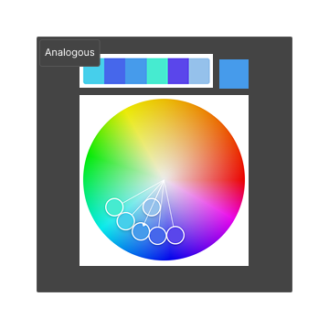
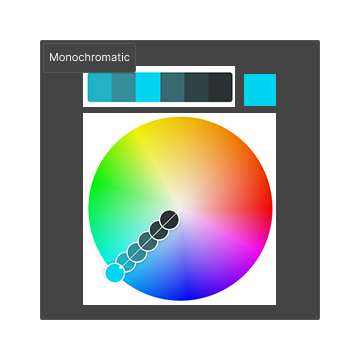
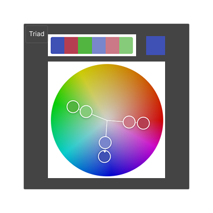
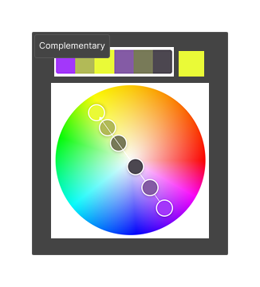
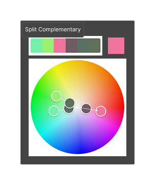
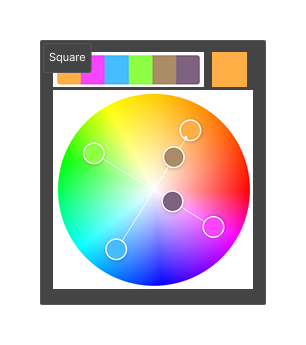
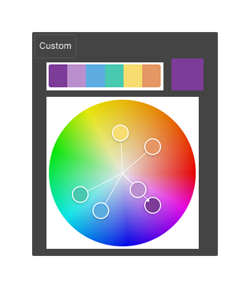
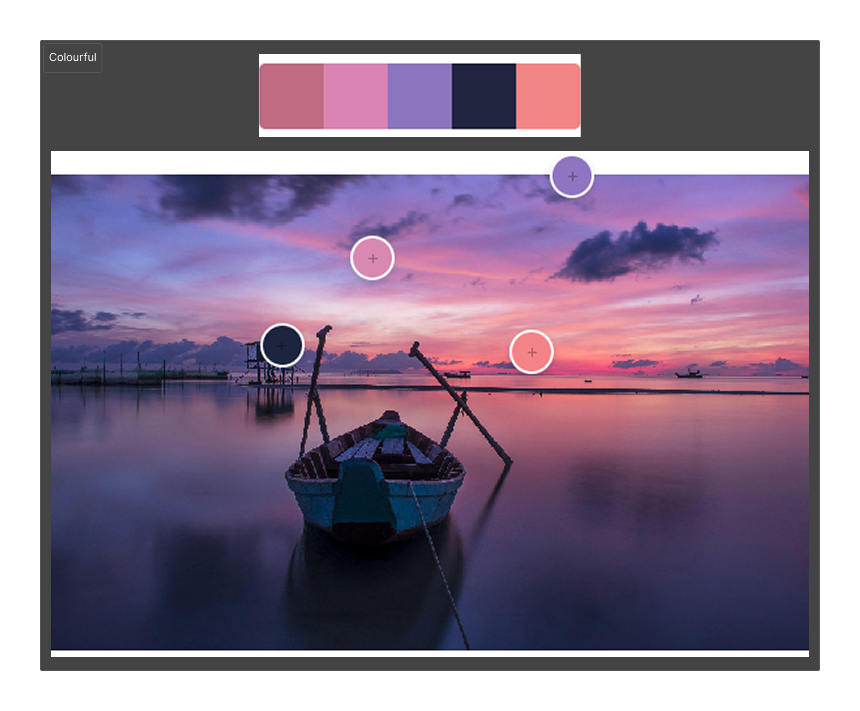
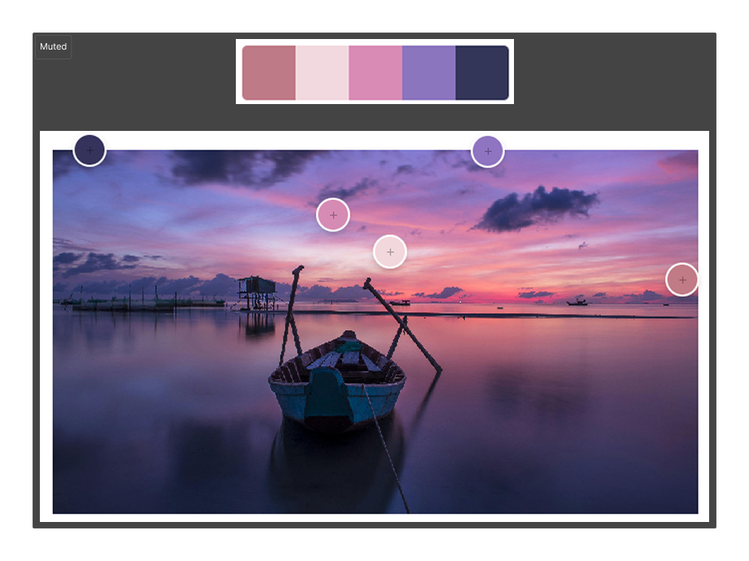
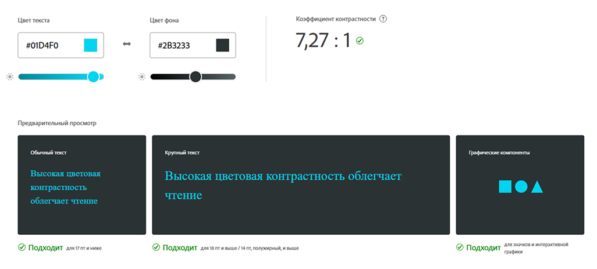

# Практична №11 Дослідження кольорових гармоній та інструментів аналізу кольору в [Adobe Color](https://color.adobe.com/)

## Виконав:  
**Судєв Артем Володимирович**  
**Група: ІПЗ-2.03**  

## Завдання:
1. Ознайомитися з поняттям кольорової гармонії, типами гармоній та колірними моделями
2. Створити палітри за різними принципами гармонії за допомогою Adobe Color
3. Згенерувати палітри зображень (Extract Theme) та градієнт (Extract Gradient)
4. Перевірити контрастність кольорових пар відповідно до стандартів доступності (WCAG)
5. Написати звіт

---

## Хід роботи:
1. Аналіз
    - Ознайомитись з типами кольорових гармоній: Analogous, Monochromatic, Triad, Complementary, Split Complementary, Square, Custom
    - Розібратися з відмінностями між колірними моделями RGB, HSB, LAB
    - Досліджено інтерфейс Adobe Color для створення гармоній та перевірки контрастності кольорів
2. Теоретична частина
    - Кольорова гармонія — це влучне поєднання кольорів, яке захоплює погляд, створює баланс і викликає естетичне задоволення. У дизайні вона допомагає формувати інтерфейси, які не тільки зручні й зрозумілі, а й візуально приваблюють користувача.
    - Типи гармоній:
        - Analogous — схожі кольори поруч на колі
        - Monochromatic — один колір у різній насиченості
        - Triad — три кольори, рівновіддалені на колі
        - Complementary — протилежні кольори
        - Split Complementary — два сусідніх до комплементарного
        - Square — чотири рівновіддалені кольори
        - Custom — побудова за власним вибором
    - Колірні моделі:
        - RGB — для цифрових екранів
        - HSB — відтінок, насиченість, яскравість
        - LAB — математична модель для точного порівняння
    - Контрастність і WCAG — Стандарти WCAG 2.1 встановлюють рівні доступності (AA, AAA) для тексту щодо фону. Контраст забезпечує читабельність для всіх користувачів
3. Результати
    - Color Wheel:
        - Створено палітри для кожного типу гармонії
        - Для кожної палітри зазначено базовий колір, зроблено скріншоти та додано короткий опис логіки побудови та передбачуваного емоційного ефекту  
            | Тип гармонії | Базовий колір | Скріншот | Логіка побудови і передбачуваний емоційний ефект |
            |--------------|---------------|----------|--------------------------------------------------|
            | Analogous | #469BEB |  | Палітра із суміжних кольорів створює спокійну, природну атмосферу. Чудово підходить для використання головного кольору з підтримувальними та акцентними відтінками. |
            | Monochromatic | #01D4F0 |  | Однотонна палітра з різними відтінками одного кольору. Ефект збалансованої гармонії та глибини, з акцентами, які підкреслюють основний тон. |
            | Triad | #3F51B5 |  | Три рівномірно розподілених кольори на колесі створюють динамічну і живу палітру. Один колір домінує, а два інших слугують акцентами. |
            | Complementary Harmony | #EAFA37 |  |  Протилежні кольори на колесі створюють контраст і енергійне поєднання, що підходить для виділення елементів і створення яскравих акцентів. |
            | Split Complementary | #F0759C |  | Основний колір — рожевий, доповнений контрастними м’ятним і сіро-зеленим. Палітра збалансована, але водночас додає яскравості завдяки акцентам. |
            | Square | #FFAE45 |  |  Чотири рівномірно розташовані кольори на колесі. Палітра яскрава й енергійна, при цьому зберігає баланс і гармонію. |
            | Custom | #7D3C98 |  |Елегантне поєднання фіолетового, блакитного, зеленого і теплих відтінків, що створює відчуття розкоші та гармонії. |
    - Extract Theme:
        - Завантажено зображення в розділ Extract Theme  
            
        - Створено дві палітри: Colorful та Muted  
            | Тип | Скріншот | Коментар |
            |-----|----------|----------|
            | Colorful |  | Жива, емоційна палітра — привертає увагу, добре для акцентів. |
            | Muted |  | Спокійна, збалансована — зручна для інтерфейсу, не втомлює очі. |  

            **Висновок:** Muted краще підходить для додатку — комфортна та стримана.
    - Extract Gradient:
        - Завантажено те саме зображення в розділ Extract Gradient  
            
        - Створено градієнт з трьома кольоровими точками (Gradient Stops = 3)
    - Accessibility Tools:
        - Вибрана палітра Monochromatic
        - Кольори #01D4F0 та #2B3233 для тексту та заднього фону відповідно  
              
            **Висновок:** Комбінація кольорів відповідає стандартам доступності. Рівень контрастності — 7.27. Це означає, що пара проходить перевірку як для звичайного тексту, так і для великого тексту. Комбінація безпечна та зручна для читання.

4. Висновки
    >**Найзручніші для інтерфейсів** — Для інтерфейсного дизайну найбільш зручними виявилися палітри *Monochromatic*, *Analogous* і *Muted* — вони створюють візуальний баланс, не перевантажують очі й добре працюють у фоні або як підтримка контенту. Яскравіші схеми, як *Triadic* чи *Square*, більше підходять для акцентів або маркетингових матеріалів. Перевірка комбінації #01D4F0 на #2B3233 підтвердила відповідність стандартам WCAG (контраст 7.27), що гарантує комфортне і доступне сприйняття тексту. Adobe Color виявився зручним інструментом для підбору гармонійних кольорів, створення градієнтів та оцінки контрасту.